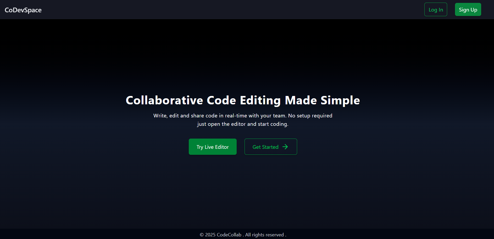

# 🧑‍💻 codeCollab – Real-Time Collaborative Code Editor

codeCollab is a real-time collaborative code editor that allows multiple users to write and edit code simultaneously with <100ms latency. It supports 10+ programming languages, syntax highlighting, and user authentication. Built for seamless team collaboration and developer experience.

---

## 🌟 Features

- 🧠 Real-time multi-user code collaboration (WebSocket)
- 🔒 Supabase authentication with secure session handling
- 🎨 Syntax highlighting for 10+ languages (powered by Monaco Editor)
- ⚡ Fast and responsive frontend built with React + TypeScript
- 🌐 REST API backend with Node.js and Express
- 📊 Optimized for performance: 40% faster API responses
- 🛡️ Role-based access control
- 💾 Session persistence support (retains code state per user)

---

## 🛠️ Tech Stack

**Frontend:**  
`React` · `TypeScript` · `Tailwind CSS` · `Monaco Editor`  

**Backend:**  
`Node.js` · `Express` · `WebSocket`

**Auth & DB:**  
`Supabase` (Auth + Realtime)

**Tools:**  
`Vite` · `GitHub Actions` · `Postman`

---

## 🚀 Live Demo

🔗 **Live Link:** [collab-code-editor.netlify.app](https://collab-code-editor.netlify.app)  
🔗 **GitHub Repo:** [github.com/dev-ankit-mishra/collab-code-editor](https://github.com/dev-ankit-mishra/collab-code-editor)

---

## 📸 Screenshots

> _Add screenshots here (optional for visual appeal)_  
> You can drag & drop images into the repo and reference like:  
> 

---

## 🧪 How to Run Locally

```bash
# 1. Clone the repo
git clone https://github.com/dev-ankit-mishra/collab-code-editor.git

# 2. Install dependencies
cd collab-code-editor
npm install

# 3. Start the development server
npm run dev
